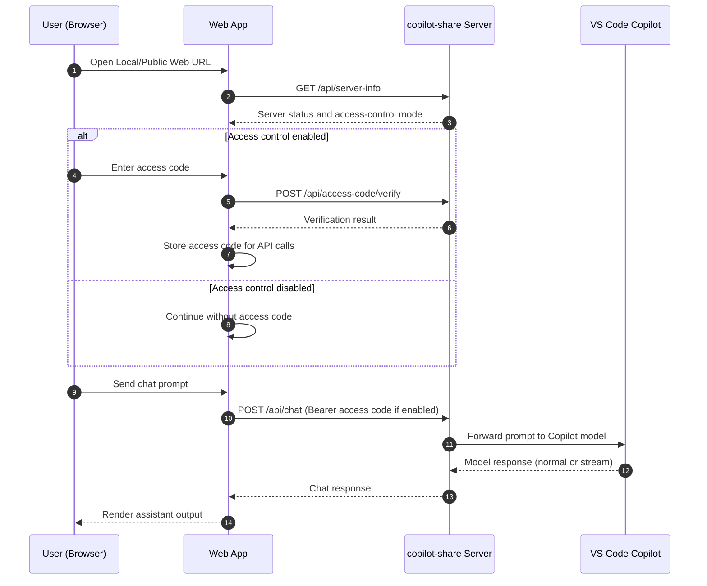

# Copilot Instructions For copilot-share

This repository is a VS Code extension that hosts a local LAN web hub for Copilot chat workflows.

## Project Intent

- Extension id: `copilot-share`
- Primary command: `copilot-share.open-control-menu`
- Entry point: `src/extension.ts`
- UX anchor: status bar item + control menu (start/stop server, open/copy URLs, manage access code)
- Runtime model: VS Code extension backend + local HTTP server + browser web app frontend
- Product framing: session-oriented workflow (prompts and sessions are treated as work assets)
- Primary user value: let one VS Code host share Copilot chat across LAN devices with low setup friction.
- Reliability priority: keep hosting, access control, and chat paths predictable over adding niche features.

Use README as the canonical product narrative and user scenario reference.

## Product Guardrails

- Keep this extension LAN-first. Do not introduce internet relay/cloud dependencies unless explicitly requested.
- Keep startup and control flow simple: status bar item opens one control menu that manages sharing.
- Preserve backwards-compatible API payloads and endpoint names unless migration/versioning is introduced.
- Use the term `access code` for user-facing auth language.

## Architecture At A Glance

**1. Extension activation** (`src/extension.ts`):
- Activates on startup.
- Creates status bar UI controller via `createStatusBarUiController(...)`.
- Registers `copilot-share.open-control-menu` command.
- Wires server state change handler to UI refresh.

**2. Status/control UI** (`src/ui.ts`):
- Shows status bar icon/text for running/stopped state.
- Control menu supports:
  - Start/Stop sharing.
  - Open/Copy local URL.
  - Open/Copy public URL.
  - Access code operations (copy/regenerate/set) when applicable.
  - Status icon customization (persisted in global state key `statusCodiconOption`).
- On public URL copy, shows a QR code in a secure webview panel.

**3. HTTP server + API** (`src/network.ts`):
- Serves static files from `src/webapp`.
- Picks configured start port from `copilot-share.port` (default 6800), falls back upward if busy.
- Binds to `0.0.0.0` and computes LAN URLs from network interfaces.
- Access control mode is selectable per start session.
- Uses bearer auth for protected endpoints when access control is enabled.

**4. LLM bridge** (`src/llm.ts`):
- Uses VS Code LM API (`vscode.lm.selectChatModels`) with Copilot vendor preference.
- Keeps in-memory session turns and optional compacted summary context.
- Supports chat, session summary, and prompt polish request modes.
- Supports streamed chunk callbacks for NDJSON response mode.

**5. Web frontend** (`src/webapp`):
- Main page: `src/webapp/index.html`
- Client app logic: `src/webapp/js/app.js`
- Network/auth bridge: `src/webapp/js/message.js`, `src/webapp/js/copilot-share.js`
- Capabilities: Session management, message operations, search, summary view, prompt polish flow, import/export, and mobile-friendly behavior.

**6. Runtime Request Sequence** (Open Web -> Verify Access Code -> Chat)

## API Contract (Current)

Backend endpoints in `src/network.ts`:

- `POST /api/access-code/verify`
- `POST /api/chat` (supports normal + stream mode)
- `POST /api/chat/reset`
- `POST /api/chat/clone-context`
- `POST /api/chat/rebuild-context`
- `GET /api/models`
- `GET /api/server-info`

Access control behavior:

- When access control is enabled, protected APIs require `Authorization: Bearer <access-code>`.
- Protected paths: `/api/chat`, `/api/chat/reset`, `/api/chat/clone-context`, `/api/chat/rebuild-context`.
- Use terminology `access code` (not `token`) in UX/docs unless protocol semantics explicitly require token wording.

## Stable Invariants

- Keep command id `copilot-share.open-control-menu` stable.
- Keep extension id `copilot-share` stable.
- Keep status bar + control menu as the primary control surface.
- Keep static asset serving rooted at `src/webapp`.
- Keep server binding on LAN-capable host (`0.0.0.0`) unless explicitly changed.
- Keep access control toggle behavior tied to start-session mode selection.

## Working Rules For Changes

- Preserve command id, extension id, and user-facing control menu flow unless explicitly requested.
- Keep `README.md` and implementation aligned when changing behavior.
- Do not silently break LAN sharing behavior (port selection, URL generation, or access control).
- Keep request/response schemas backward-compatible unless versioning/migration is explicitly handled.
- Preserve existing status bar/controller lifecycle and cleanup semantics on deactivate.
- For access-control changes, update both extension control UI (`src/ui.ts`) and web auth flow (`src/webapp/js/copilot-share.js`, `src/webapp/js/message.js`).

## Change Strategy For Copilot

When implementing a feature or fix:

1. Identify affected layer(s): extension UI, network API, LLM bridge, web app UI.
2. Prefer minimal, surgical edits over broad refactors.
3. Preserve existing command names, endpoint names, and payload shapes.
4. If behavior changes, update docs (`README.md`) in the same change.
5. For auth or LAN behavior, validate both positive and failure flows.

When uncertain:

- Prefer explicit, conservative behavior over implicit magic.
- Do not remove existing safeguards (lock checks, auth checks, lifecycle cleanup) without replacement.
- Ask for clarification only when a change would alter stable invariants.

## Validation Guidance

When making meaningful changes:

- Build/watch with project scripts in `package.json`.
- Ensure extension activation still wires command + status bar.
- Verify start/stop sharing from control menu.
- Verify local/public URL actions.
- Verify access code flow:
  - verify prompt in web UI,
  - verify `/api/access-code/verify`,
  - verify protected API authorization.
- Verify chat request path (non-stream and stream where relevant).
- Verify stop/deactivate cleanup leaves no stale running server state.

## Review Focus

For code reviews in this repo, prioritize:

1. Behavioral regressions in start/stop/status/menu flows.
2. LAN and auth safety regressions.
3. API compatibility and stream behavior correctness.
4. Web UI state integrity (session lock, stream cancel, summary/polish flows).
5. Missing tests or validation notes for changed behavior.

## Important Files

- `src/extension.ts` - activation and lifecycle wiring.
- `src/ui.ts` - status bar UI and control menu.
- `src/network.ts` - server lifecycle, routing, auth, static serving.
- `src/llm.ts` - model selection, history, summarization/polish modes.
- `src/doc/context-build.md` - detailed session context lifecycle, token budgeting, compaction, and rebuild behavior reference.
- `src/webapp/index.html` - app shell.
- `src/webapp/js/app.js` - chat/session UI logic.
- `src/webapp/js/message.js` - fetch/stream model bridge.
- `src/webapp/js/copilot-share.js` - access code prompt/verification helper.
- `README.md` - product scenario and operation guidance.

## Copilot Response Preference In This Repo

- Be implementation-first and concrete.
- Reference exact file paths and symbols when proposing changes.
- For feature work, describe both extension-side and webapp-side impact.
- For reviews, prioritize behavioral regressions and LAN/auth safety.
- If introducing tradeoffs, state risks and the safer alternative briefly.

## Release Checklist

Use this checklist before every Marketplace publish:

- Confirm metadata in `package.json`: `publisher`, `version`, `license`, `homepage`, `bugs`, `categories`, `keywords`.
- Update `CHANGELOG.md` with user-facing changes for the release version.
- Verify web assets are packaged: run `npx @vscode/vsce package --no-yarn` and confirm `src/webapp/**` is included in the VSIX file list.
- Run quality gates: `npm run pretest`.
- Run automated local release checks: `npm run release:checklist`.
- Validate tag/version alignment before publish: `npm run release:check-tag -- v<version>`.
- Manually smoke test in Extension Development Host:
   - Start Sharing and Stop Sharing from the control menu.
   - Open and copy local/public URLs.
   - Verify access control flow with `/api/access-code/verify`.
   - Verify protected chat APIs require bearer access code when access control is enabled.
- Install the generated VSIX locally and retest key flows on at least one second LAN device.
- Tag the release in git, then publish with `npm run publish:vsce`.
