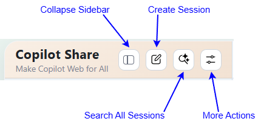
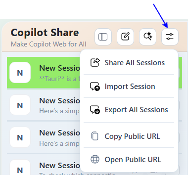
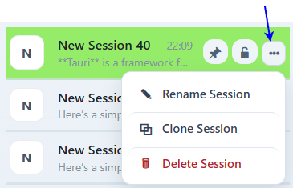
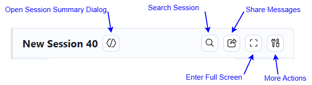
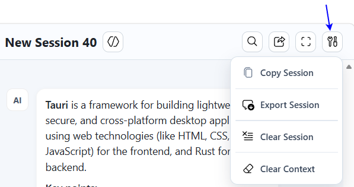
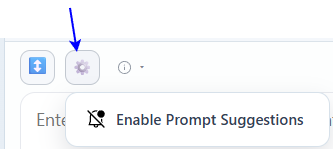

## Overview
🚢**copilot-share** is a VS Code extension that brings Copilot from the VS Code IDE to a local web hub, delivering a streamlined user experience through robust session/conversation operations and reliable context management. 

This extension helps you:
- Access Copilot across devices on your local network
- Easily share with family, friends, coworkers, or teams

🚀**copilot-share** introduces the [session-oriented workflow](#session-oriented-workflow) that treats prompts and sessions as reusable, reviewable work assets—just like source code. 

This approach helps you:
- Organize and track LLM-driven work by objective or project
- Build a personal or team knowledge base for smarter reuse
- Review, refine, and share prompt sessions for better outcomes
- Accelerate solution prototyping and AI-driven demonstrations

This workflow is ideal for technical showcases, collaborative solution design, and building knowledge graphs or POC demos with AI.

⛽**copilot-share** provides additional standout features. 

- Process user prompts from multiple chat sessions concurrently
- Provide a Prompt Polish button to help users start using Copilot from draft prompts.
- PWA‑enabled webpage for native‑app‑like installation and usage

⚙️**copilot-share** operates in a simple [framework](#framework).

♨️Get started with **copilot-share** using the quick guide below.

1. [Install this extension](#install-extension)
2. [Host and Manage the web hub](#host-and-manage-the-web-hub)
   - [1. Open Control Menu Dialog](#1-open-control-menu-dialog)
   - [2. Control Menu Description](#2-control-menu-description)
   - [3. Start the Web Hub](#3-start-the-web-hub)
   - [4. Stop the Web Hub](#4-stop-the-web-hub)
   - [5. Use the Web Hub](#5-use-the-web-hub)
      - [5.1 Launch Web Hub on Host Device](#51-launch-web-hub-on-host-device)
      - [5.2 Global Controls](#52-global-controls)
      - [5.3 Session Operation Buttons](#53-session-operation-buttons)
      - [5.4 Conversation Operation Buttons](#54-conversation-operation-buttons)
3. [Use Copilot in the Web Page](#use-copilot-in-the-web-page)
   - [1. Session Operation Examples](#1-session-operation-examples)
   - [2. Conversation Operation Examples](#2-conversation-operation-examples)

## Session-Oriented Workflow

Traditionally, we used code to build applications and services. Because of that, we reviewed code to ensure it matched design goals and business scenarios, and that it met expectations for runtime reliability (memory/concurrency/I/O), privacy, and network safety.

Today, prompts guide LLMs to generate code, documentation, and resource files.

In this model:
- Prompts are like source code.
- Sessions are like source files.

That means prompts and sessions should be:
- Treated as core work assets, just like code and source files.
- Reviewed with the same level of discipline used for code and source files,
  so we can confirm direction, validate objectives, find gaps early, avoid misleading outputs, and reduce the risk of accepting responses that sound convincing but are inaccurate.
- Used to build a personal knowledge base or knowledge graph—ideal for technical showcases, solution prototyping, AI-driven demonstrations, and proof-of-concept (POC) workflows, enabling smarter reuse and accelerated innovation. 

Why call it session-oriented?
- A session is a deliberate container for multiple prompts that serve one objective. This is why I call it a session-oriented workflow: it offers a structured way to manage complex projects when prompts drive LLM-based implementation.

## Framework

- **Client-Host Topology**

## Install Extension
1. Install copilot-share by clicking the VS Code extensions icon () and searching for `"copilot share"`.
2. After installation completes, the status bar will show the extension icon ().

## Host and Manage the Web Hub

### 1. Open Control Menu Dialog

- Click the extension icon () in the status bar to open the control menu window.

### 2. Control Menu Description

| Menu                 | Purpose |
|----------------------|---------|
| HTTP Service         | Show the web hub status: running state, port in use, and access control status.|
| Start Sharing        | Start the web hub with access control toggled on or off.|
| Stop Sharing         | Stop the web hub.|
| Open Local Web       | Open the web hub at the local URL (`http://127.0.0.1:***/`).|
| Copy Local URL       | Copy the local web hub URL.|
| Open Public Web      | Open the web hub using its LAN-accessible public URL.|
| Copy Public URL      | Copy the public URL and show a QR code for quick access on another device.|
| Regenerate Access Code | Generate a new access code for the web hub.|
| Copy Access Code     | Copy the current access code.|
| Set Access Code      | Manually set the access code.|
| Set Status Bar Icons | Select the status bar icons for the extension.|

### 3. Start the Web Hub

- Click `Start Sharing` in the control menu to start the web hub. 
   - copilot-share lets you enable or disable access control for local area network (LAN) usage.
   

### 4. Stop the Web Hub
- Click `Stop Sharing` in the control menu to shut down the web hub. 

### 5. Use the Web Hub

#### 5.1 Launch Web Hub on Host Device

1. Click `Open Local Web` or `Open Public Web` in the control menu to use Copilot in a browser on your host device. 
   - Web Hub UI: 
   

#### 5.2 Global Controls

1. UI Buttons
   - 

2. More Actions
   - 

3. Button Purpose Description

| Button               | Purpose |
|----------------------|---------|
| Collapse Sidebar     | Toggle the sidebar between expanded and collapsed views to focus your workspace.|
| Create Session   | Start a new chat session with Copilot.|
| Search All Sessions  | Find matching text across every session in one search.|
| More Actions         | Open the More Actions menu for additional workspace controls.|
| Share All Sessions   | Export conversations from all sessions to individual Markdown files and download them as a single ZIP package for sharing and review.|
| Import Session     | Import a Markdown session file to restore a previous conversation and metadata.|
| Export All Sessions  | Export conversations and metadata from all sessions to individual Markdown files and download them as a single ZIP package for local backup, rebuild, review and transfer.|
| Copy Public URL      | Copy the LAN-accessible web hub URL for quick sharing to other devices.|
| Open Public URL      | Open the LAN-accessible web hub URL in your browser.|

#### 5.3 Session Operation Buttons

1. UI Buttons
   - 

2. More Actions
   - 

3. Button Purpose Description

| Button         | Purpose |
|----------------|---------|
| Pin Session    | Pin/Unpin this session to the top of the session list for quick access.|
| Lock Session   | Lock/Unlock this session to prevent accidental updates or edits.|
| More Actions   | Open the More Actions menu for additional session-list options.|
| Rename Session | Give this session a clearer, more meaningful name.|
| Clone Session  | Duplicate this session with its full context for fast reuse.|
| Delete Session | Permanently remove this session when it is no longer needed.|

#### 5.4 Conversation Operation Buttons

1. UI Buttons
   - 

2. More Actions
   - 

3. Session Summary Dialog
   - 

4. Input Area
   - 

5. More Input Actions
   - 

6. User Prompt Context Menu
   - 

7. Agent Response Context Menu
   - 

8. Button Description

| Button         | Purpose |
|----------------|---------|
| Open Session Summary Dialog | Open the Session Summary dialog to generate and manage summary results.|
| Search Session | Search for matching text within the current session.|
| Share Session   | Export the current session conversation as a Markdown file for sharing and review.|
| Enter Full Screen | Enter or exit full-screen mode for a more focused workspace.|
| More Actions    | Open the More Actions menu for additional session options.|
| Copy Session    | Copy the current session conversation to the clipboard for quick sharing.|
| Export Session  | Export the current session conversation and metadata as a Markdown file for backup, rebuild, review, or transfer.|
| Clear Session   | Clear the current session conversation, metadata, and context.|
| Clear Context   | Clear only the current session context while keeping messages intact.|
| Rebuild Context | Clear and then rebuild the current session context using all existing session messages, while preserving the visible conversation state intact. |
| Back To Session | Close the summary dialog and return to the current session header.|
| Summarize Session Messages | Generate a concise summary of the current session to surface key topics and critical points, removing redundant noise.|
| Open Summary in Mini Window | Open summary results in a compact mini window.|
| Copy Summary    | Copy summary results to the clipboard.|
| Share Summary   | Export current summary results as a Markdown file for sharing and review.|
| Clear Summary   | Clear the current summary results.|
| Drag to resize input area | Drag to increase or decrease the input area height.|
| More Input Actions | Open the More Actions menu for additional input options.|
| Input Tips      | Show prompt-writing tips while you type.|
| Model Picker    | Show available models and let you choose one.|
| Polish Prompt   | Refine the original prompt so it guides Copilot more effectively.|
| Copy Original Prompt | Copy the original user prompt.|
| Send Prompt     | Send the current prompt to the backend.|
| Enable Prompt Suggestions | Enable suggestions based on similar historical prompts while you type.|
| Copy | Copy Markdown content of selected user prompts or agent responses.|
| Favorite | Mark selected user prompts or agent responses as favorites.|
| Select Multiple | Select multiple user prompts or agent responses to perform `Copy`, `Favorite`, and `Delete` actions in batch. |
| Retry | Resend the selected user prompt to generate a new agent response. |
| Delete | Permanently delete selected user prompts or agent responses.|

## Use Copilot in the Web Page
Access the web hub to use Copilot through a session-oriented workflow.

### 1. Session Operation Examples

| Operation      | User Interaction |
|----------------|---------|
|Locate Session|Easily locate sessions from the session list|
|Reorder Session|Drag a session with a mouse on PC, or long-press and swipe on mobile|
|Search Messages within Current Session|Click [`Search Session`](#current-session-ui-buttons)|
|Search Messages Across All Sessions|Click [`Search All Sessions`](#global-controls-ui-buttons)|
|Manage Session Lifecycle|Click [`Create Session`](#global-controls-ui-buttons), [`Rename Session`](#session-list-more-actions), [`Delete Session`](#session-list-more-actions), [`Pin Session`](#session-list-interactions), and [`Lock Session`](#session-list-interactions)|
|Export Current Session including conversation and metadata|Click [`Export Session`](#current-session-more-actions)|
|Import Session for Rebuild|Click [`Import Session`](#global-controls-more-actions)|
|Copy Session Conversation to Clipboard for Review|Click [`Copy Session`](#current-session-ui-buttons)|
|Share Session Conversation via MD file for Review|Click [`Share Session`](#current-session-more-actions)|
|Clone Session for Reuse|Click [`Clone Session`](#session-list-more-actions)|
|Summarize Session to Remove Chat Noise and Focus on Key Outcomes|Click [`Open Session Summary Dialog`](#current-session-ui-buttons)|
|Manage Session Results|Click buttons in [`Session Summary Dialog`](#current-session-session-summary-dialog)|
|Clear Session Conversation and Context|Click [`Clear Session`](#current-session-more-actions)|
|Clear Only Session Context|Click [`Clear Context`](#current-session-more-actions)|
|Rebuild Session Context|Click [`Rebuild Context`](#current-session-more-actions)|

### 2. Conversation Operation Examples

| Operation        | User Interaction |
|------------------|---------|
| Select Model     | Click [`Model Picker`](#current-session-input-area)|
| Polish Prompt    | Click [`Polish Prompt`](#current-session-input-area)|
| Resend Prompt    | Click `Retry` in the [`user prompt context menu`](#user-prompt-context-menu)|
| Enable Prompt Suggestions| Click [`Enable Prompt Suggestions`](#current-session-input-area-more-actions)|
| Copy Message     | Click `Copy` in the [`user prompt context menu`](#user-prompt-context-menu) or [`agent response context menu`](#agent-response-context-menu)|
| Favorite Message | Click `Favorite` in the [`user prompt context menu`](#user-prompt-context-menu) or [`agent response context menu`](#agent-response-context-menu)|
| Delete Message   | Click `Delete` in the [`user prompt context menu`](#user-prompt-context-menu) or [`agent response context menu`](#agent-response-context-menu)|

